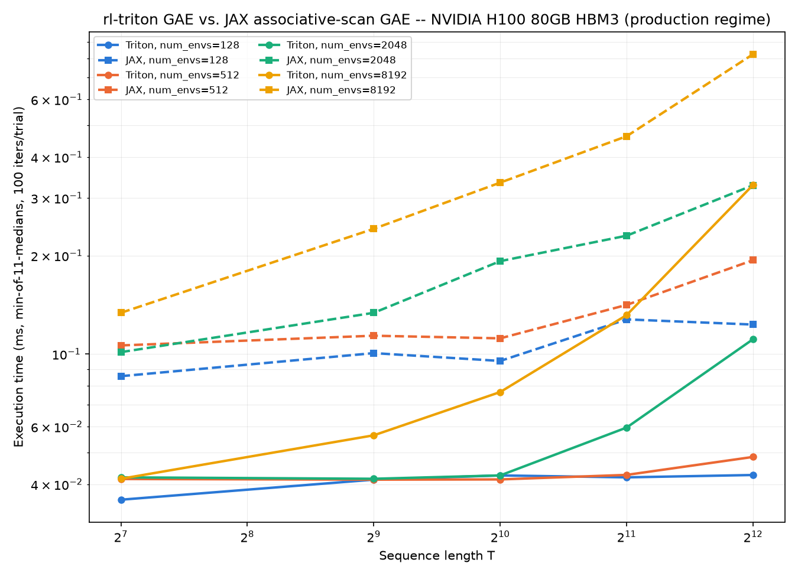
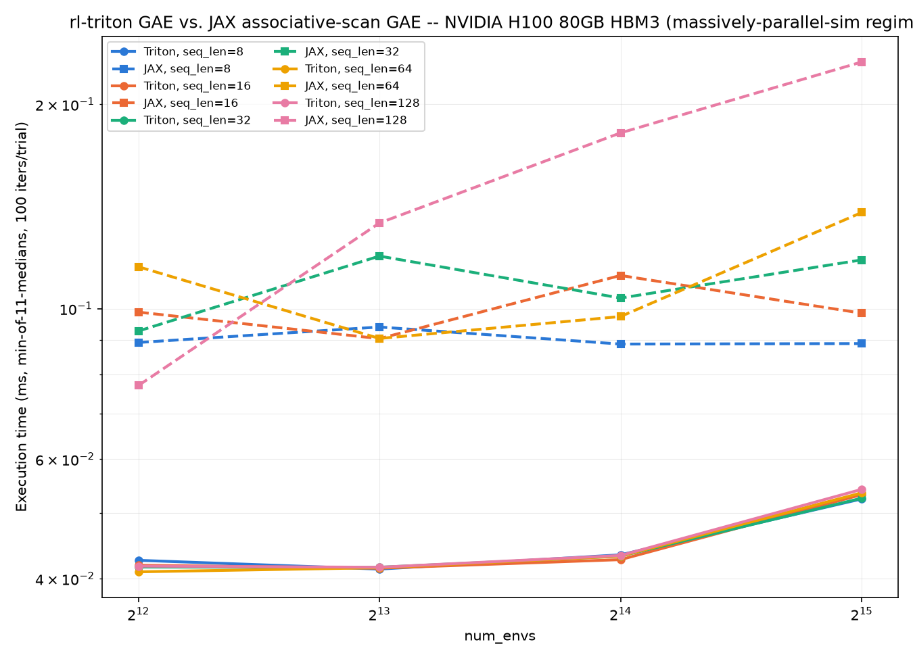

# rl-triton GAE vs. JAX associative-scan GAE -- 2026-09-15

ONE-OFF deep-dive study (equivalence proof, launch counts, bandwidth, crossover plots) -- not part of the release cycle, not regenerated automatically. Mirrors gae_vs_pufferlib-*.md's structure but is NOT directly comparable to it: this baseline is JAX/XLA's `jax.lax.associative_scan` (a log-depth parallel scan, compiled by XLA), not PufferLib's hand-written sequential CUDA kernel. Produced by a three-phase, two-venv pipeline (benchmark_gae_vs_jax_scan_{triton,jax,report}.py) -- see benchmark_gae_vs_jax_scan_triton.py's module docstring for why (a real torch/jax cuDNN pin conflict, not a design preference) and for the full index-mapping derivation between rl-triton's and the JAX baseline's buffer conventions. JAX's numbers are wall-clock only (time.perf_counter + block_until_ready, in a separate process from Triton's CUDA-event timing) -- no device-only/launch-count columns exist for JAX in this setup.

GPU: NVIDIA RTX 4000 Ada Generation · torch 2.4.1+cu121 (cuda 12.1) · triton 3.0.0 · jax 0.10.2 (backend=gpu)
dtype float32 · gamma=0.99 · lambda=0.95 · termination_prob=0.05

Equivalence gate passed (see console output) -- both implementations verified to compute the same recurrence (under the derived index mapping) before any timing number below is trusted.

## Production regime

seq_len in [128, 512, 1024, 2048, 4096], num_envs in [128, 512, 2048, 8192].

| num_envs | seq_len | triton (ms) | jax (ms) | speedup | triton amort (ms) | jax amort (ms) | triton GB/s (%peak) | jax GB/s (%peak) | triton dev (us) | triton launches |
|---|---|---|---|---|---|---|---|---|---|---|
| 128 | 128 | 0.0525 | 0.0968 | 1.84x | 0.0352 | 0.0606 | 5.0 (0.15%) | 3.4 (0.10%) | 1.46 | 1.0 |
| 128 | 512 | 0.0642 | 0.1206 | 1.88x | 0.0400 | 0.0599 | 16.3 (0.49%) | 10.9 (0.32%) | 2.28 | 1.0 |
| 128 | 1024 | 0.0632 | 0.1742 | 2.76x | 0.0385 | 0.0611 | 33.2 (0.99%) | 15.1 (0.45%) | 3.43 | 1.0 |
| 128 | 2048 | 0.0628 | 0.1474 | 2.35x | 0.0422 | 0.0622 | 66.8 (2.00%) | 35.6 (1.06%) | 6.45 | 1.0 |
| 128 | 4096 | 0.0667 | 0.1825 | 2.74x | 0.0379 | 0.0791 | 125.8 (3.76%) | 57.5 (1.72%) | 12.93 | 1.0 |
| 512 | 128 | 0.0626 | 0.1068 | 1.71x | 0.0375 | 0.0753 | 16.8 (0.50%) | 12.4 (0.37%) | 2.02 | 1.0 |
| 512 | 512 | 0.0622 | 0.2009 | 3.23x | 0.0375 | 0.0818 | 67.4 (2.01%) | 26.1 (0.78%) | 4.62 | 1.0 |
| 512 | 1024 | 0.0630 | 0.1476 | 2.34x | 0.0375 | 0.0680 | 133.2 (3.98%) | 71.1 (2.12%) | 8.89 | 1.0 |
| 512 | 2048 | 0.0652 | 0.2466 | 3.78x | 0.0378 | 0.0832 | 257.4 (7.68%) | 85.1 (2.54%) | 19.88 | 1.0 |
| 512 | 4096 | 0.0850 | 0.4039 | 4.75x | 0.0393 | 0.2370 | 394.9 (11.79%) | 103.9 (3.10%) | 38.71 | 1.0 |
| 2048 | 128 | 0.0615 | 0.1022 | 1.66x | 0.0374 | 0.0736 | 68.2 (2.04%) | 51.6 (1.54%) | 4.47 | 1.0 |
| 2048 | 512 | 0.0627 | 0.2218 | 3.54x | 0.0375 | 0.0693 | 267.5 (7.98%) | 94.7 (2.83%) | 14.51 | 1.0 |
| 2048 | 1024 | 0.0760 | 0.3920 | 5.16x | 0.0386 | 0.2302 | 441.5 (13.18%) | 107.1 (3.20%) | 30.27 | 1.0 |
| 2048 | 2048 | 0.2512 | 0.6365 | 2.53x | 0.2072 | 0.5275 | 267.2 (7.98%) | 131.9 (3.94%) | 206.33 | 1.0 |
| 2048 | 4096 | 0.4757 | 1.4236 | 2.99x | 0.4262 | 1.2652 | 282.1 (8.42%) | 117.9 (3.52%) | 428.98 | 1.0 |
| 8192 | 128 | 0.0643 | 0.2025 | 3.15x | 0.0387 | 0.0608 | 260.8 (7.79%) | 104.2 (3.11%) | 14.39 | 1.0 |
| 8192 | 512 | 0.2504 | 0.6886 | 2.75x | 0.2065 | 0.5248 | 268.0 (8.00%) | 122.0 (3.64%) | 205.57 | 1.0 |
| 8192 | 1024 | 0.4538 | 1.4026 | 3.09x | 0.4100 | 1.2604 | 295.8 (8.83%) | 119.7 (3.57%) | 409.25 | 1.0 |
| 8192 | 2048 | 0.8618 | 2.8158 | 3.27x | 0.8171 | 2.6223 | 311.5 (9.30%) | 119.2 (3.56%) | 816.28 | 1.0 |
| 8192 | 4096 | 1.7080 | 5.6116 | 3.29x | 1.6528 | 5.4021 | 314.3 (9.38%) | 119.6 (3.57%) | 1667.33 | 1.0 |

**Verdict:** Triton faster in 20/20 cells; JAX faster in 0/20 cells.

## Massively-parallel-sim regime (short horizon, high env count)

seq_len in [8, 16, 32, 64, 128], num_envs in [4096, 8192, 16384, 32768].

| num_envs | seq_len | triton (ms) | jax (ms) | speedup | triton amort (ms) | jax amort (ms) | triton GB/s (%peak) | jax GB/s (%peak) | triton dev (us) | triton launches |
|---|---|---|---|---|---|---|---|---|---|---|
| 4096 | 8 | 0.0642 | 0.0971 | 1.51x | 0.0383 | 0.0650 | 8.2 (0.24%) | 7.4 (0.22%) | 4.13 | 1.0 |
| 4096 | 16 | 0.0624 | 0.1177 | 1.89x | 0.0383 | 0.0768 | 16.8 (0.50%) | 11.7 (0.35%) | 4.16 | 1.0 |
| 4096 | 32 | 0.0632 | 0.0954 | 1.51x | 0.0386 | 0.0698 | 33.2 (0.99%) | 28.2 (0.84%) | 4.39 | 1.0 |
| 4096 | 64 | 0.0627 | 0.1065 | 1.70x | 0.0370 | 0.0675 | 66.9 (2.00%) | 49.9 (1.49%) | 4.65 | 1.0 |
| 4096 | 128 | 0.0635 | 0.1407 | 2.22x | 0.0399 | 0.0689 | 132.2 (3.95%) | 75.0 (2.24%) | 7.92 | 1.0 |
| 8192 | 8 | 0.0633 | 0.0991 | 1.56x | 0.0382 | 0.0607 | 16.6 (0.49%) | 14.5 (0.43%) | 7.02 | 1.0 |
| 8192 | 16 | 0.0639 | 0.0872 | 1.36x | 0.0379 | 0.0576 | 32.8 (0.98%) | 31.6 (0.94%) | 7.13 | 1.0 |
| 8192 | 32 | 0.0630 | 0.1117 | 1.77x | 0.0387 | 0.0455 | 66.6 (1.99%) | 48.1 (1.44%) | 7.20 | 1.0 |
| 8192 | 64 | 0.0623 | 0.1516 | 2.43x | 0.0379 | 0.0571 | 134.6 (4.02%) | 70.0 (2.09%) | 8.04 | 1.0 |
| 8192 | 128 | 0.0643 | 0.2025 | 3.15x | 0.0387 | 0.0608 | 260.8 (7.79%) | 104.2 (3.11%) | 14.39 | 1.0 |
| 16384 | 8 | 0.0633 | 0.1130 | 1.79x | 0.0383 | 0.0696 | 33.1 (0.99%) | 25.5 (0.76%) | 12.66 | 1.0 |
| 16384 | 16 | 0.0623 | 0.1308 | 2.10x | 0.0383 | 0.0575 | 67.3 (2.01%) | 42.1 (1.26%) | 12.74 | 1.0 |
| 16384 | 32 | 0.0631 | 0.1318 | 2.09x | 0.0381 | 0.0578 | 132.9 (3.97%) | 81.6 (2.44%) | 12.91 | 1.0 |
| 16384 | 64 | 0.0629 | 0.1627 | 2.59x | 0.0374 | 0.0598 | 266.5 (7.96%) | 130.5 (3.89%) | 14.71 | 1.0 |
| 16384 | 128 | 0.0726 | 0.3229 | 4.44x | 0.0381 | 0.2164 | 461.9 (13.79%) | 130.7 (3.90%) | 27.08 | 1.0 |
| 32768 | 8 | 0.0686 | 0.1022 | 1.49x | 0.0368 | 0.0655 | 61.1 (1.82%) | 56.5 (1.69%) | 24.02 | 1.0 |
| 32768 | 16 | 0.0693 | 0.1224 | 1.77x | 0.0382 | 0.0529 | 121.0 (3.61%) | 89.9 (2.69%) | 24.02 | 1.0 |
| 32768 | 32 | 0.0692 | 0.1847 | 2.67x | 0.0388 | 0.0513 | 242.4 (7.24%) | 116.4 (3.47%) | 24.13 | 1.0 |
| 32768 | 64 | 0.0738 | 0.3611 | 4.89x | 0.0390 | 0.2186 | 454.7 (13.57%) | 117.6 (3.51%) | 27.83 | 1.0 |
| 32768 | 128 | 0.2499 | 0.6839 | 2.74x | 0.2062 | 0.5236 | 268.5 (8.02%) | 123.4 (3.68%) | 205.31 | 1.0 |

**Verdict:** Triton faster (wall-clock) in 20/20 cells; JAX faster in 0/20 cells.

