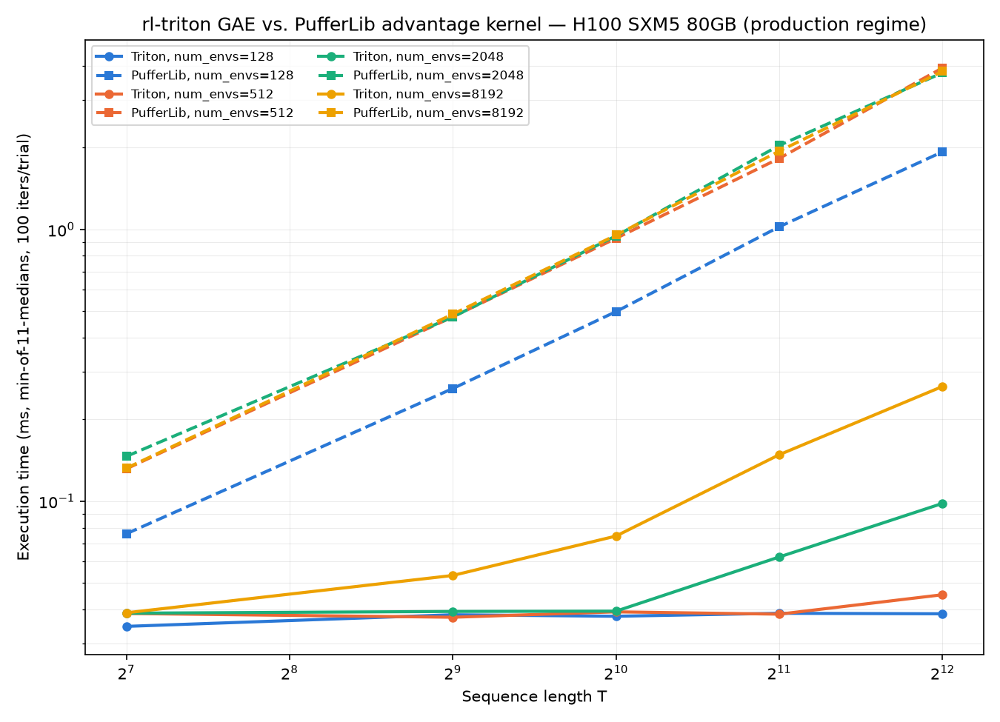
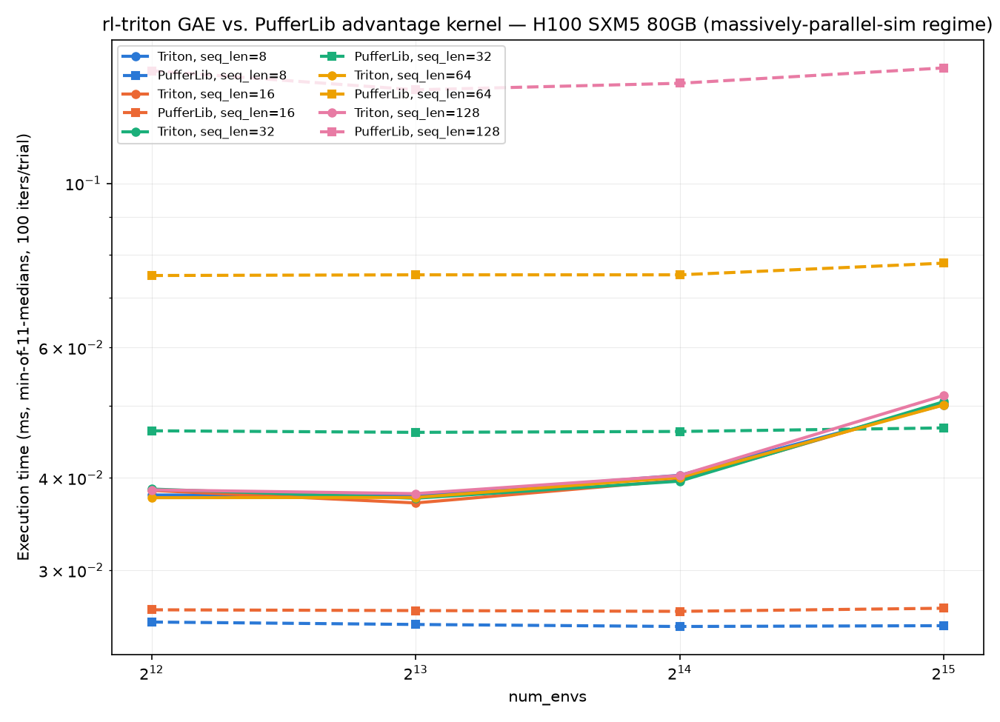

# rl-triton GAE vs. PufferLib advantage kernel -- 2026-08-05

ONE-OFF deep-dive study (equivalence proof, launch counts, bandwidth, crossover plots) -- not part of the release cycle, not regenerated automatically. See benchmarks/README.md for how this differs from compare_pufferlib.py's official, pip-only comparison (benchmarks/pufferlib.md).

**This is the data source for the paper.** `docs/figures/plot_pufferlib_production.py` and `docs/figures/plot_pufferlib_crossover.py` hardcode the production-regime and massively-parallel-sim-regime tables below into `Figure~\ref{fig:pufferlib-classic}` / `Figure~\ref{fig:pufferlib-mps}` in `docs/paper.tex`. Produced by `benchmarks/benchmark_gae_vs_pufferlib.py` (n_trials=11, not compare_pufferlib.py's n_trials=5 -- see that script's own docstring for the difference).

GPU: NVIDIA H100 80GB HBM3 · torch 2.4.1+cu124 (cuda 12.4) · triton 3.0.0 · PufferLib source: vendored pufferlib==3.0.0 pufferlib.cpp/pufferlib.cu, JIT-compiled
dtype float32 · gamma=0.99 · lambda=0.95 · termination_prob=0.05

Equivalence gate passed (see console output) -- both kernels verified to compute the same recurrence on the overlapping regime before any timing number below is trusted.

## Production regime

seq_len in [128, 512, 1024, 2048, 4096], num_envs in [128, 512, 2048, 8192].

| num_envs | seq_len | triton (ms) | puffer (ms) | speedup | dev speedup | triton amort (ms) | puffer amort (ms) | triton GB/s (%peak) | puffer GB/s (%peak) | triton dev (us) | puffer dev (us) | triton launches | puffer launches |
|---|---|---|---|---|---|---|---|---|---|---|---|---|---|
| 128 | 128 | 0.0285 | 0.0737 | 2.58x | 48.15x | 0.0181 | 0.0663 | 9.2 (0.27%) | 4.4 (0.13%) | 1.31 | 63.24 | 1.0 | 2.0 |
| 128 | 512 | 0.0321 | 0.2571 | 8.02x | 152.00x | 0.0201 | 0.2487 | 32.7 (0.98%) | 5.1 (0.15%) | 1.60 | 242.95 | 1.0 | 2.0 |
| 128 | 1024 | 0.0329 | 0.4959 | 15.09x | 248.85x | 0.0207 | 0.4853 | 63.8 (1.90%) | 5.3 (0.16%) | 1.93 | 480.58 | 1.0 | 2.0 |
| 128 | 2048 | 0.0334 | 0.9713 | 29.07x | 332.50x | 0.0204 | 0.9667 | 125.5 (3.75%) | 5.4 (0.16%) | 2.90 | 962.93 | 1.0 | 2.0 |
| 128 | 4096 | 0.0339 | 1.9295 | 56.94x | 435.38x | 0.0209 | 1.9375 | 247.5 (7.39%) | 5.4 (0.16%) | 4.40 | 1913.57 | 1.0 | 2.0 |
| 512 | 128 | 0.0338 | 0.1300 | 3.85x | 72.56x | 0.0209 | 0.1174 | 31.1 (0.93%) | 10.1 (0.30%) | 1.58 | 114.46 | 1.0 | 2.0 |
| 512 | 512 | 0.0336 | 0.4750 | 14.14x | 205.38x | 0.0208 | 0.4623 | 124.8 (3.73%) | 11.0 (0.33%) | 2.23 | 457.43 | 1.0 | 2.0 |
| 512 | 1024 | 0.0333 | 0.9265 | 27.84x | 274.27x | 0.0209 | 0.9122 | 252.1 (7.52%) | 11.3 (0.34%) | 3.32 | 911.93 | 1.0 | 2.0 |
| 512 | 2048 | 0.0340 | 1.8046 | 53.00x | 258.29x | 0.0206 | 1.7969 | 492.8 (14.71%) | 11.6 (0.35%) | 6.95 | 1794.82 | 1.0 | 2.0 |
| 512 | 4096 | 0.0419 | 3.8490 | 91.96x | 241.32x | 0.0208 | 3.8397 | 801.7 (23.93%) | 10.9 (0.33%) | 15.90 | 3837.05 | 1.0 | 2.0 |
| 2048 | 128 | 0.0335 | 0.1452 | 4.34x | 49.79x | 0.0286 | 0.1332 | 125.3 (3.74%) | 36.1 (1.08%) | 2.63 | 130.89 | 1.0 | 2.0 |
| 2048 | 512 | 0.0343 | 0.5013 | 14.60x | 103.55x | 0.0213 | 0.4889 | 488.6 (14.59%) | 41.8 (1.25%) | 4.66 | 482.81 | 1.0 | 2.0 |
| 2048 | 1024 | 0.0355 | 1.0313 | 29.06x | 109.46x | 0.0206 | 1.0218 | 945.5 (28.22%) | 40.7 (1.21%) | 9.31 | 1019.14 | 1.0 | 2.0 |
| 2048 | 2048 | 0.0527 | 1.9273 | 36.55x | 68.20x | 0.0294 | 1.9195 | 1272.5 (37.99%) | 43.5 (1.30%) | 28.12 | 1917.77 | 1.0 | 2.0 |
| 2048 | 4096 | 0.1051 | 3.8090 | 36.23x | 46.87x | 0.0813 | 3.8048 | 1276.8 (38.11%) | 44.0 (1.31%) | 81.32 | 3811.61 | 1.0 | 2.0 |
| 8192 | 128 | 0.0332 | 0.1308 | 3.94x | 18.30x | 0.0204 | 0.1194 | 505.1 (15.08%) | 160.4 (4.79%) | 6.39 | 116.83 | 1.0 | 2.0 |
| 8192 | 512 | 0.0484 | 0.4872 | 10.06x | 20.10x | 0.0255 | 0.4803 | 1386.1 (41.38%) | 172.2 (5.14%) | 23.73 | 476.91 | 1.0 | 2.0 |
| 8192 | 1024 | 0.0701 | 0.9627 | 13.73x | 20.98x | 0.0473 | 0.9561 | 1914.3 (57.14%) | 174.3 (5.20%) | 45.43 | 953.27 | 1.0 | 2.0 |
| 8192 | 2048 | 0.1249 | 1.8933 | 15.15x | 18.20x | 0.1008 | 1.8861 | 2148.7 (64.14%) | 177.2 (5.29%) | 103.43 | 1882.37 | 1.0 | 2.0 |
| 8192 | 4096 | 0.3271 | 3.8537 | 11.78x | 12.68x | 0.3018 | 3.8483 | 1641.3 (48.99%) | 174.1 (5.20%) | 303.27 | 3846.07 | 1.0 | 2.0 |

**Verdict:** Triton faster in 20/20 cells; PufferLib faster in 0/20 cells.

## Massively-parallel-sim regime (short horizon, high env count)

seq_len in [8, 16, 32, 64, 128], num_envs in [4096, 8192, 16384, 32768].

| num_envs | seq_len | triton (ms) | puffer (ms) | speedup | dev speedup | triton amort (ms) | puffer amort (ms) | triton GB/s (%peak) | puffer GB/s (%peak) | triton dev (us) | puffer dev (us) | triton launches | puffer launches |
|---|---|---|---|---|---|---|---|---|---|---|---|---|---|
| 4096 | 8 | 0.0340 | 0.0220 | 0.65x | 1.04x | 0.0209 | 0.0137 | 15.4 (0.46%) | 29.8 (0.89%) | 3.59 | 3.72 | 1.0 | 2.0 |
| 4096 | 16 | 0.0339 | 0.0240 | 0.71x | 2.58x | 0.0209 | 0.0136 | 30.9 (0.92%) | 54.7 (1.63%) | 3.60 | 9.30 | 1.0 | 2.0 |
| 4096 | 32 | 0.0335 | 0.0442 | 1.32x | 8.15x | 0.0210 | 0.0317 | 62.7 (1.87%) | 59.3 (1.77%) | 3.62 | 29.48 | 1.0 | 2.0 |
| 4096 | 64 | 0.0337 | 0.0737 | 2.19x | 15.66x | 0.0205 | 0.0615 | 124.4 (3.71%) | 71.1 (2.12%) | 3.75 | 58.75 | 1.0 | 2.0 |
| 4096 | 128 | 0.0339 | 0.1393 | 4.11x | 31.71x | 0.0207 | 0.1273 | 247.5 (7.39%) | 75.3 (2.25%) | 3.91 | 123.96 | 1.0 | 2.0 |
| 8192 | 8 | 0.0342 | 0.0218 | 0.64x | 0.64x | 0.0208 | 0.0135 | 30.7 (0.92%) | 60.1 (1.80%) | 6.04 | 3.86 | 1.0 | 2.0 |
| 8192 | 16 | 0.0333 | 0.0241 | 0.72x | 1.55x | 0.0207 | 0.0135 | 63.0 (1.88%) | 108.9 (3.25%) | 6.05 | 9.40 | 1.0 | 2.0 |
| 8192 | 32 | 0.0336 | 0.0442 | 1.32x | 4.89x | 0.0207 | 0.0319 | 124.9 (3.73%) | 118.6 (3.54%) | 6.08 | 29.74 | 1.0 | 2.0 |
| 8192 | 64 | 0.0333 | 0.0731 | 2.19x | 9.46x | 0.0205 | 0.0611 | 251.6 (7.51%) | 143.4 (4.28%) | 6.22 | 58.78 | 1.0 | 2.0 |
| 8192 | 128 | 0.0336 | 0.1313 | 3.91x | 18.34x | 0.0206 | 0.1197 | 499.3 (14.91%) | 159.7 (4.77%) | 6.39 | 117.14 | 1.0 | 2.0 |
| 16384 | 8 | 0.0363 | 0.0218 | 0.60x | 0.37x | 0.0208 | 0.0135 | 57.7 (1.72%) | 120.3 (3.59%) | 10.96 | 4.04 | 1.0 | 2.0 |
| 16384 | 16 | 0.0363 | 0.0242 | 0.67x | 0.87x | 0.0206 | 0.0136 | 115.5 (3.45%) | 217.0 (6.48%) | 10.98 | 9.60 | 1.0 | 2.0 |
| 16384 | 32 | 0.0367 | 0.0444 | 1.21x | 2.73x | 0.0210 | 0.0324 | 228.7 (6.83%) | 235.9 (7.04%) | 11.00 | 30.09 | 1.0 | 2.0 |
| 16384 | 64 | 0.0367 | 0.0733 | 2.00x | 5.33x | 0.0207 | 0.0617 | 457.5 (13.66%) | 286.1 (8.54%) | 11.14 | 59.42 | 1.0 | 2.0 |
| 16384 | 128 | 0.0368 | 0.1340 | 3.64x | 10.47x | 0.0208 | 0.1248 | 912.6 (27.24%) | 313.0 (9.34%) | 11.58 | 121.28 | 1.0 | 2.0 |
| 32768 | 8 | 0.0459 | 0.0226 | 0.49x | 0.25x | 0.0221 | 0.0137 | 91.4 (2.73%) | 232.4 (6.94%) | 20.81 | 5.22 | 1.0 | 2.0 |
| 32768 | 16 | 0.0462 | 0.0244 | 0.53x | 0.49x | 0.0221 | 0.0136 | 181.7 (5.42%) | 429.5 (12.82%) | 20.83 | 10.19 | 1.0 | 2.0 |
| 32768 | 32 | 0.0464 | 0.0449 | 0.97x | 1.49x | 0.0222 | 0.0333 | 361.6 (10.79%) | 467.4 (13.95%) | 20.85 | 31.09 | 1.0 | 2.0 |
| 32768 | 64 | 0.0467 | 0.0763 | 1.63x | 3.00x | 0.0225 | 0.0670 | 718.7 (21.45%) | 550.0 (16.42%) | 21.18 | 63.56 | 1.0 | 2.0 |
| 32768 | 128 | 0.0480 | 0.1412 | 2.94x | 5.69x | 0.0247 | 0.1342 | 1397.2 (41.71%) | 594.2 (17.74%) | 22.88 | 130.07 | 1.0 | 2.0 |

**Verdict:** Triton faster (wall-clock) in 11/20 cells; PufferLib faster in 9/20 cells. Triton faster (device-only) in 15/20 cells; PufferLib faster (device-only) in 5/20 cells.

